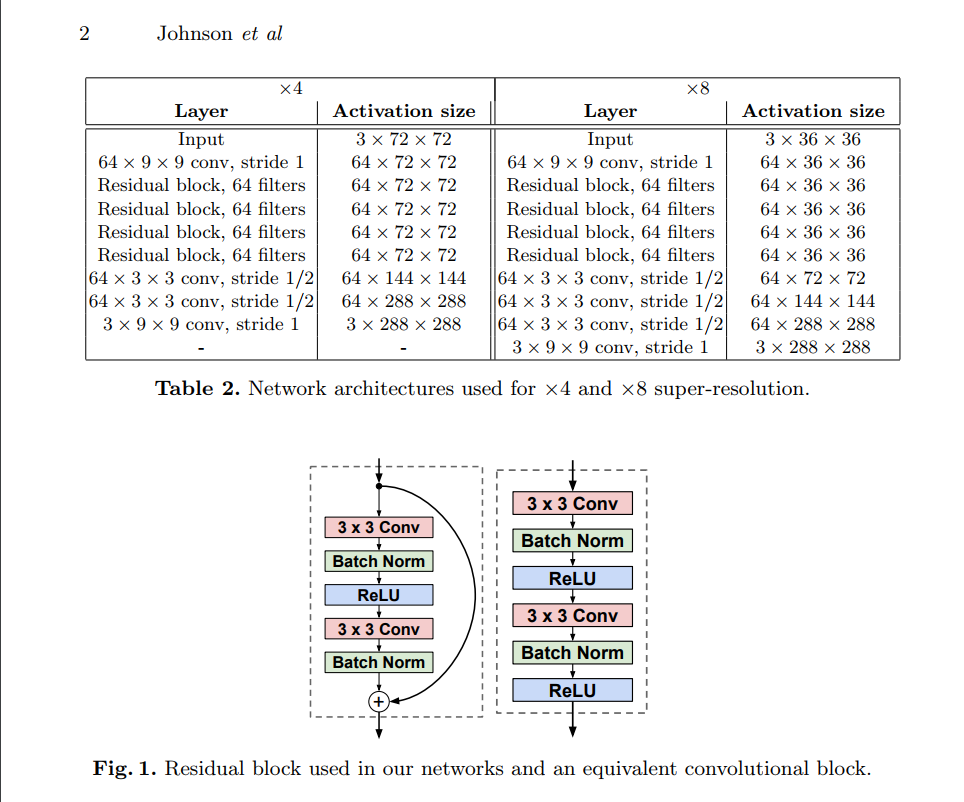

# Super_Resolution
Pytorch 4x Super Resolution with Perceptual loss https://arxiv.org/pdf/1603.08155.pdf

```bazaar
setup:
Download any image dataset and aim the dataloader root at it
I used the Imagenet Dection Training Set from Kaggle.com
```
- [x] Data Loader for ImageNet
- [x] FCRNN Architecture
- [x] FCRNN train
- [x] Johnson FCResnet Architecture - http://cs.stanford.edu/people/jcjohns/papers/eccv16/JohnsonECCV16Supplementary.pdf
- [x] Replace Transposed Conv with upsample blocks (https://distill.pub/2016/deconv-checkerboard/) 
- [x] Johnson Train 
- [x] Perceptual loss - https://arxiv.org/pdf/1603.08155.pdf

## Architecture


## Content Loss


## Outputs
### Input


### Model Output


### Target

